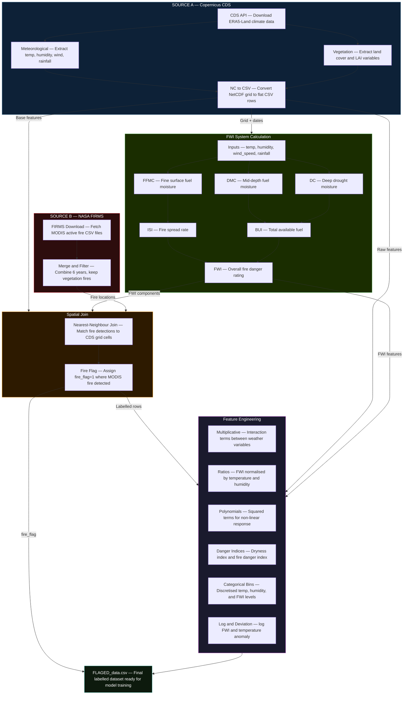
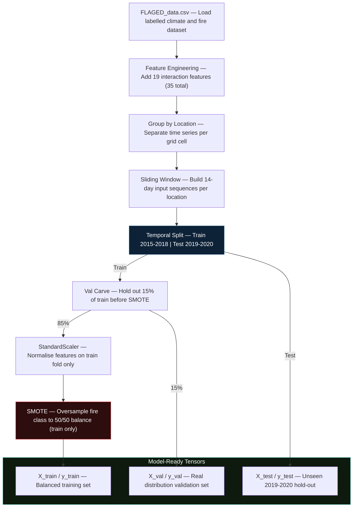

# Data Preparation Pipeline — FWI Wildfire Prediction
## Paste into https://mermaid.live

---

## Diagram 1 — Full Data Pipeline

```mermaid
flowchart TD

subgraph CDS["SOURCE A — Copernicus CDS"]
    CDS_API["CDS API — Download ERA5-Land climate data"]
    CDS_MET["Meteorological — Extract temp, humidity, wind, rainfall"]
    CDS_VEG["Vegetation — Extract land cover and LAI variables"]
    NC2CSV["NC to CSV — Convert NetCDF grid to flat CSV rows"]
    CDS_API --> CDS_MET --> NC2CSV
    CDS_API --> CDS_VEG --> NC2CSV
end

subgraph FIRMS["SOURCE B — NASA FIRMS"]
    FIRMS_DL["FIRMS Download — Fetch MODIS active fire CSV files"]
    FIRMS_MERGE["Merge and Filter — Combine 6 years, keep vegetation fires"]
    FIRMS_DL --> FIRMS_MERGE
end

subgraph FWI_CALC["FWI System Calculation"]
    FWI_IN["Inputs — temp, humidity, wind_speed, rainfall"]
    FFMC_N["FFMC — Fine surface fuel moisture"]
    DMC_N["DMC — Mid-depth fuel moisture"]
    DC_N["DC — Deep drought moisture"]
    ISI_N["ISI — Fire spread rate"]
    BUI_N["BUI — Total available fuel"]
    FWI_N["FWI — Overall fire danger rating"]
    FWI_IN --> FFMC_N --> ISI_N --> FWI_N
    FWI_IN --> DMC_N  --> BUI_N --> FWI_N
    FWI_IN --> DC_N   --> BUI_N
end

subgraph SPATIAL["Spatial Join"]
    SJOIN["Nearest-Neighbour Join — Match fire detections to CDS grid cells"]
    FLAG["Fire Flag — Assign fire_flag=1 where MODIS fire detected"]
    SJOIN --> FLAG
end

subgraph FEAT_ENG["Feature Engineering"]
    F1["Multiplicative — Interaction terms between weather variables"]
    F2["Ratios — FWI normalised by temperature and humidity"]
    F3["Polynomials — Squared terms for non-linear response"]
    F4["Danger Indices — Dryness index and fire danger index"]
    F5["Categorical Bins — Discretised temp, humidity, and FWI levels"]
    F6["Log and Deviation — log FWI and temperature anomaly"]
end

FINAL["FLAGED_data.csv — Final labelled dataset ready for model training"]

NC2CSV      -->|"Grid + dates"| FWI_CALC
NC2CSV      -->|"Base features"| SPATIAL
FWI_N       -->|"FWI components"| SPATIAL
FIRMS_MERGE -->|"Fire locations"| SPATIAL
FLAG        -->|"Labelled rows"| FEAT_ENG
NC2CSV      -->|"Raw features"| FEAT_ENG
FWI_N       -->|"FWI features"| FEAT_ENG
FEAT_ENG    --> FINAL
FLAG        -->|"fire_flag"| FINAL

style CDS      fill:#0d2137,stroke:#457B9D,color:#ffffff
style FIRMS    fill:#2d0d0d,stroke:#E63946,color:#ffffff
style FWI_CALC fill:#1a2d00,stroke:#4CAF50,color:#ffffff
style SPATIAL  fill:#2d1a00,stroke:#FF9800,color:#ffffff
style FEAT_ENG fill:#1a1a2d,stroke:#9C27B0,color:#ffffff
style FINAL    fill:#0d1a0d,stroke:#2A9D8F,color:#ffffff
```

---

## Diagram 2 — ML Sequence Pipeline

```mermaid
flowchart TD
    RAW["FLAGED_data.csv — Load labelled climate and fire dataset"]
    ENG["Feature Engineering — Add 19 interaction features (35 total)"]
    GROUP["Group by Location — Separate time series per grid cell"]
    WINDOW["Sliding Window — Build 14-day input sequences per location"]
    TSPLIT["Temporal Split — Train 2015-2018 | Test 2019-2020"]
    VALSPLIT["Val Carve — Hold out 15% of train before SMOTE"]
    SCALE["StandardScaler — Normalise features on train fold only"]
    SMOTE["SMOTE — Oversample fire class to 50/50 balance (train only)"]

    subgraph OUT["Model-Ready Tensors"]
        T["X_train / y_train — Balanced training set"]
        V["X_val / y_val — Real distribution validation set"]
        TE["X_test / y_test — Unseen 2019-2020 hold-out"]
    end

    RAW --> ENG --> GROUP --> WINDOW --> TSPLIT
    TSPLIT -->|"Train"| VALSPLIT
    TSPLIT -->|"Test"| TE
    VALSPLIT -->|"85%"| SCALE
    VALSPLIT -->|"15%"| V
    SCALE --> SMOTE --> T

    style OUT    fill:#0d1a0d,stroke:#2A9D8F,color:#ffffff
    style SMOTE  fill:#2d0d0d,stroke:#E63946,color:#ffffff
    style TSPLIT fill:#0d2137,stroke:#457B9D,color:#ffffff
```
