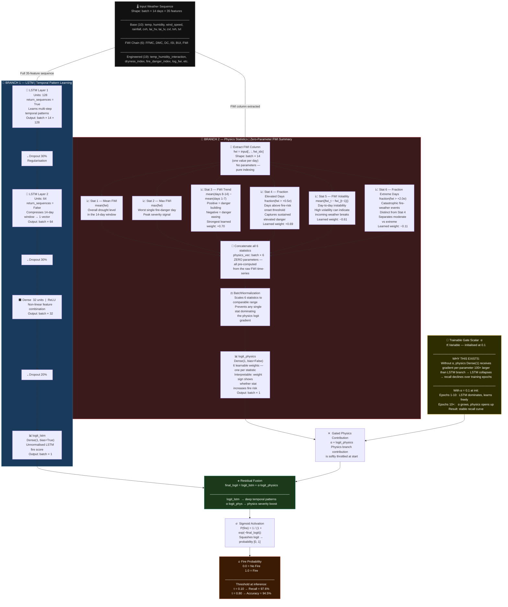
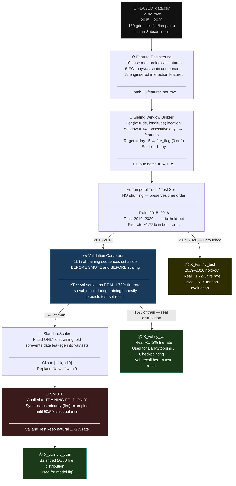
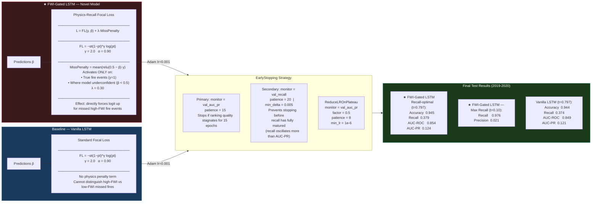
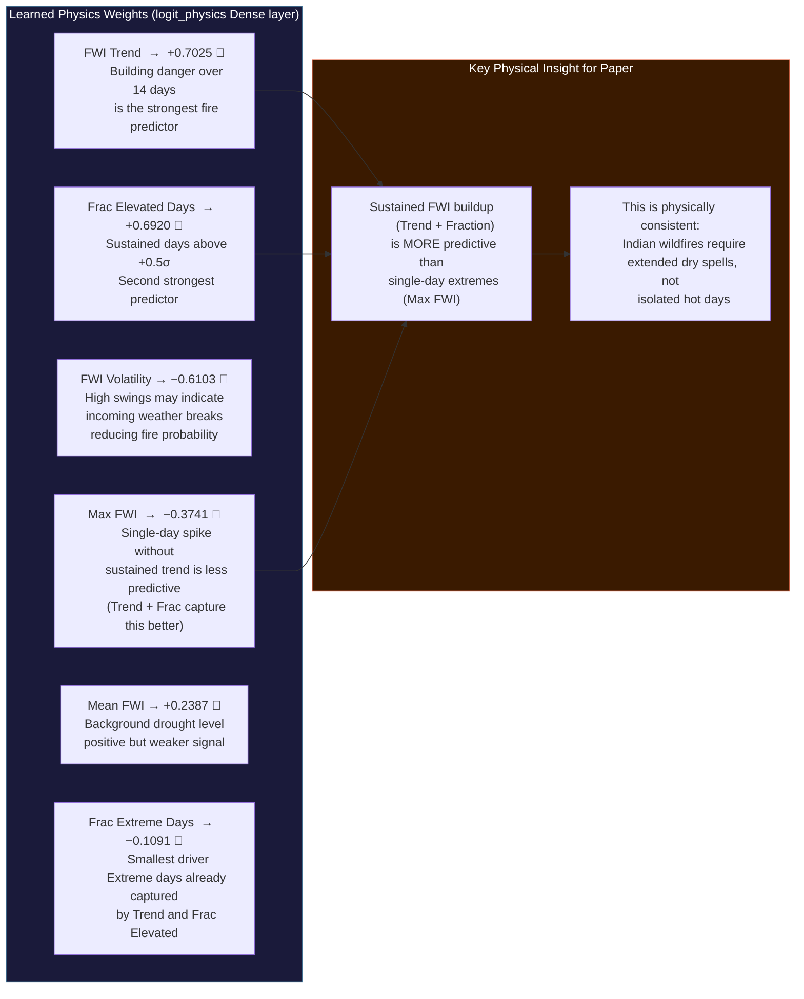

# FWI-Gated LSTM — Architecture Diagrams
## Paste each mermaid block into https://mermaid.live or mermaid.ai

---

## Diagram 1 — Full Model Architecture

---

## Diagram 2 — Data Pipeline (Sequence Builder)

---

## Diagram 3 — Training & Loss

---

## Diagram 4 — Physics Weight Interpretation

